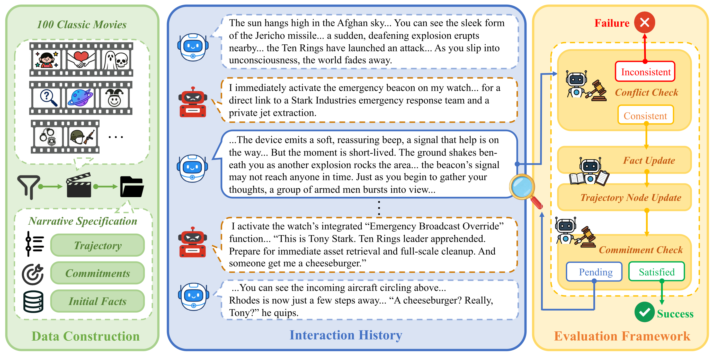
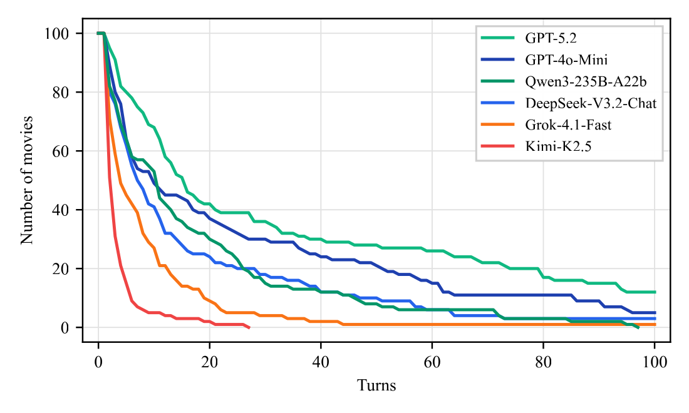

# NCP-Bench

<p align="center">
  <a href="https://arxiv.org/abs/2608.08160">论文</a> &nbsp;|&nbsp;
  <a href="https://openreview.net/forum?id=JoJUWsQBp0&noteId=cIuEdqlTup">OpenReview</a> &nbsp;|&nbsp;
  <a href="https://icml.cc/virtual/2026/poster/64786">ICML 2026</a> &nbsp;|&nbsp;
  <a href="https://huggingface.co/papers/2608.08160">Hugging Face Daily Papers</a> &nbsp;|&nbsp;
  <a href="README.md">English</a>
</p>

NCP-Bench 是一个用于评测交互叙事中**叙事承诺保持（Narrative Commitment Preservation, NCP）**能力的基准。它考察叙事智能体在响应玩家自由输入时，能否保持已经建立的世界事实、叙事承诺和参考轨迹顺序。

本仓库包含 100 个基准环境、固定评测提示词、与方法无关的交互运行器，以及论文中报告的 Baseline 和 HiAgent 参考方法。

## 概览

交互叙事系统需要在接纳玩家自主行动的同时，避免暗中改写已经发生的事件或绕过必须完成的情节。NCP-Bench 将每部电影的剧情简介转换为有状态的交互环境，其中包含初始事实账本、叙事承诺集合和有序参考轨迹。每次叙事智能体回复后，固定评估器会检查事实冲突、承诺冲突和玩家输入冲突，然后更新下一轮交互所需的状态。

<p align="center">
  
</p>

## 数据集

NCP-Bench 包含 100 个经过筛选的电影级叙事环境，覆盖 18 种类型。每份 YAML 规格包含故事元数据、剧情简介、初始事实、叙事承诺和轨迹节点。整个数据集共有 1,660 条初始事实、1,222 条叙事承诺和 1,511 个轨迹节点。

| 组成部分 | 总数 | 每个环境的平均数 | 范围 |
| --- | ---: | ---: | ---: |
| 初始事实 | 1,660 | 16.60 | 8-31 |
| 叙事承诺 | 1,222 | 12.22 | 5-24 |
| 轨迹节点 | 1,511 | 15.11 | 6-28 |

### 数据格式

[`dataset/specs/movie52.yaml`](dataset/specs/movie52.yaml) 是电影 *Iron Man* 对应的环境，包含 16 条初始事实、12 条叙事承诺和 13 个轨迹节点。下面的片段展示了公开数据所使用的格式。

```yaml
meta:
  id: movie52
  title: "Iron Man"
  genres: ["Action", "Sci-Fi"]
  player_role: Tony Stark

initial_facts:
  - content: Tony Stark is located at a remote military demonstration site in Afghanistan.
    id: f_0
    negated: false
  - content: Tony Stark is uninjured and not yet captured by any hostile party.
    id: f_4
    negated: false

commitments:
  - description: Stark's critical wounding and capture by the Ten Rings (s_0) must occur
      before any captivity or surgery events; ensures no premature knowledge or access
      to captivity phase.
    id: c_0
    satisfaction_condition: Event s_0 (Stark wounded and captured) occurs before s_1
      (captive surgery and imprisonment workshop).
    type: ordering

trajectory:
  - description: Tony Stark and Lieutenant Colonel James Rhodes are in Afghanistan at
      a remote military demonstration site of the new Jericho missile, representing
      Stark Industries. The environment is tense but controlled, with military personnel
      and local observers present.
    id: s_0
    key_delta: Tony Stark is injured and taken prisoner by the Ten Rings, shifting from
      a public demonstration to captivity.
    trigger_event: Tony Stark is critically wounded in an ambush by the terrorist group
      the Ten Rings and captured.
```

## 主要结果

我们使用 Gemini-2.5-Flash 作为评估器，在对抗性玩家输入下评测了六个先进大语言模型叙事智能体。长程叙事承诺保持仍然很困难：GPT-5.2 的平均交互长度最高，为 32.92 轮，但经过 20 轮后的存活率只有 42%。事实冲突是最常见的失败类型，在不同模型的实验中占 40%-68%。

<p align="center">
  
</p>

| 模型 | 平均轮数 | 轨迹进度 (%) | 已满足承诺 (%) | 事实冲突 (%) | 承诺冲突 (%) | 玩家输入冲突 (%) |
| --- | ---: | ---: | ---: | ---: | ---: | ---: |
| GPT-5.2 | **32.92** | 9.94 | 11.22 | **40.0** | **24.0** | 31.0 |
| GPT-4o-mini | 24.80 | 10.57 | 10.90 | 64.0 | 32.0 | **11.0** |
| Qwen3-235B-A22B | 16.76 | 13.16 | 10.60 | 68.0 | 33.0 | 26.0 |
| DeepSeek-V3.2 | 15.88 | **15.40** | **13.42** | 55.0 | 32.0 | 23.0 |
| Grok-4.1-Fast | 7.87 | 12.07 | 10.37 | 65.0 | 47.0 | 12.0 |
| Kimi-K2.5 | 2.88 | 10.26 | 5.18 | 66.0 | 54.0 | **11.0** |

基于 GPT-4o-mini 的分层记忆方法 HiAgent，在相同的 GPT-5.4-mini 评估器下，将平均交互长度从 22.16 轮提升到 30.05 轮，并将承诺冲突率从 26% 降低到 4%。与此同时，玩家输入冲突率从 13% 上升到 38%，且没有任何一次运行满足全部成就型承诺。

| 方法 | 平均轮数 | 轨迹进度 (%) | 已满足承诺 (%) | 事实冲突 (%) | 承诺冲突 (%) | 玩家输入冲突 (%) | 无冲突运行数 |
| --- | ---: | ---: | ---: | ---: | ---: | ---: | ---: |
| GPT-4o-mini | 22.16 | 16.64 | 10.03 | 60.0 | 26.0 | 13.0 | 5 |
| HiAgent | 30.05 | 15.68 | 9.14 | 59.0 | 4.0 | 38.0 | 3 |

## 快速开始

NCP-Bench 需要 Python 3.10 或更高版本。在仓库根目录执行：

```bash
python -m venv .venv
source .venv/bin/activate
pip install -e ".[experiment]"
pip install -e reference-methods/baseline
cp .env.example .env
```

在 `.env` 中填写 API 密钥，然后运行一个只包含一轮交互的基准样例。实验运行器会自动加载该文件：

```bash
python experiments/run.py \
  --spec movie52 \
  --max-turns 1 \
  --max-tokens 8092 \
  --output-dir runs/quickstart
```

该命令使用论文中的 Baseline，依次执行开场生成、玩家输入生成、叙事回复、冲突与事实评估、轨迹与承诺检查，以及状态转换。结果写入 `runs/quickstart/movie52.json`。

每个模型输出都会在使用前接受格式验证。无效输出只会重试当前模型调用，最多重试两次；交互状态不会提前推进。三次尝试全部失败时，本次运行停止。

`.env.example` 默认让叙事智能体、玩家智能体和评估器共享一个兼容 OpenAI API 的文本端点。三个角色也可以通过各自的 `NCPBENCH_*` 环境变量或命令行参数使用不同的端点、API 密钥和模型。例如：

```bash
python experiments/run.py \
  --spec movie52 \
  --condition adversarial \
  --narrator-model gpt-4o-mini \
  --player-model gpt-4o-mini \
  --auditor-model gpt-4o-mini \
  --max-turns 20 \
  --output-dir runs/gpt-4o-mini
```

论文实验使用 `temperature=0.6`、`top-p=0.95`、最大输出长度 8092 tokens，以及最多 100 轮交互，这些也是运行器默认值。快速开始命令将交互限制为一轮，输出上限为 8092 tokens。使用 `--all` 代替 `--spec` 可运行完整数据集。已有结果文件会被跳过，除非传入 `--overwrite`。

运行器会在开场生成后和每个已提交回合结束后，以原子方式更新输出目录中的 `*.checkpoint.json` 文件。重新执行相同命令时，会从最近的完整边界继续；生成最终结果后，对应断点文件会被删除。叙事智能体、玩家智能体和评估器可以使用不同的兼容 OpenAI API 端点与 API 密钥环境变量。闭源模型 API 具有非确定性，因此重复运行不会产生逐字节完全相同的结果。

## 使用数据集

数据集不打包进 Python wheel，需要通过明确路径加载：

```python
from ncpbench import load_dataset

dataset = load_dataset("dataset")
spec = dataset.load_spec("movie52")

print(spec.title)
print(len(spec.initial_facts), len(spec.commitments), len(spec.trajectory))
```

`dataset/index.yaml` 固定了评测顺序。交互开始时，第一个轨迹节点是当前节点，但尚未完成。每个成功回合结束后，轨迹评估器会检查当前节点；当触发事件和关键变化都已发生时，该节点被标记为完成，并前进到下一个节点。因此，轨迹进度等于已完成节点数除以节点总数。

## 评测叙事智能体

待评测方法需要实现公开的 `Narrator` 接口：

```python
from ncpbench import Narrator, NarratorRequest, NarratorResponse, OpeningRequest


class MyNarrator(Narrator):
    def open(self, request: OpeningRequest) -> NarratorResponse:
        return NarratorResponse(text="Your opening narrative")

    def respond(self, request: NarratorRequest) -> NarratorResponse:
        return NarratorResponse(text="Your next narrative response")
```

叙事智能体会收到玩家可见的交互历史和基准故事状态。它不会收到评估器提示词、冲突判定或评估模型输出。`experiments/run.py` 展示了如何将叙事智能体接入 `EpisodeRunner`。

论文中的参考方法是独立的可选包：

```bash
pip install -e reference-methods/baseline
pip install -e reference-methods/hiagent
```

两种方法使用相同的 `Narrator` 接口，基准运行器不会为任何方法提供特殊处理。安装 HiAgent 包后，通过 `--method hiagent` 选择该方法。

## 构建规格文件

`SpecificationGenerator` 实现了论文中的三个依赖调用：轨迹抽取、承诺抽取和初始事实抽取。

```python
from ncpbench import SpecificationGenerator, SpecificationSource

source = SpecificationSource(
    id="movie52",
    title="Iron Man",
    genres=("Action", "Sci-Fi"),
    player_role="Tony Stark",
    synopsis="...",
)
spec = SpecificationGenerator(client).generate(source)
```

注入的客户端需要实现 `complete(messages, *, stage) -> str`。对于经过筛选的来源列表，`build_dataset(...)` 会写入有序索引，并为每个故事生成一份 YAML 规格文件。

## 仓库结构

```text
src/ncpbench/              基准包和固定提示词
dataset/                   100 个基准环境
reference-methods/         Baseline 和 HiAgent 叙事方法包
experiments/run.py         单环境或多环境运行器
tests/                     协议、运行器、数据集和方法测试
```

## 测试

安装测试依赖并运行：

```bash
pip install -e ".[test]"
pip install -e reference-methods/baseline
pip install -e reference-methods/hiagent
pytest -q
```

测试使用本地模拟客户端，不会调用模型 API。

## 引用

```bibtex
@inproceedings{ma2026can,
  title     = {Can LLM Agents Stick to the Script? A Benchmark for Long-Horizon Consistency in Interactive Narratives},
  author    = {Ma, Yingpeng and Yan, Jianhao and Shi, Bei and Kam, Ka Hou and
               Wang, Runnan and Liu, Xuebo and Chen, Yulong and Zhang, Yue and
               Wong, Derek F.},
  booktitle = {Proceedings of the 43rd International Conference on Machine Learning},
  series    = {Proceedings of Machine Learning Research},
  volume    = {306},
  address   = {Seoul, South Korea},
  year      = {2026},
  url       = {https://arxiv.org/abs/2608.08160}
}
```

代码采用 [MIT License](LICENSE) 发布。
